## Hi there 👋

<!--
**IkramDnDev/IkramDnDev** is a ✨ _special_ ✨ repository because its `README.md` (this file) appears on your GitHub profile.

 

 

  
  

  
  

  

<picture>
  <source media="(prefers-color-scheme: dark)" srcset="https://raw.githubusercontent.com/IkramDnDev/IkramDnDev/output/github-snake-dark.svg"/>
  <source media="(prefers-color-scheme: light)" srcset="https://raw.githubusercontent.com/IkramDnDev/IkramDnDev/output/github-snake.svg"/>
  
</picture>

Here are some ideas to get you started:

- 🔭 I’m currently working on ...
- 🌱 I’m currently learning ...

 

 

  
  

  
  

  

<picture>
  <source media="(prefers-color-scheme: dark)" srcset="https://raw.githubusercontent.com/IkramDnDev/IkramDnDev/output/github-snake-dark.svg"/>
  <source media="(prefers-color-scheme: light)" srcset="https://raw.githubusercontent.com/IkramDnDev/IkramDnDev/output/github-snake.svg"/>
  
</picture>

- 👯 I’m looking to collaborate on ...
- 🤔 I’m looking for help with ...
- 💬 Ask me about ...
- 📫 How to reach me: ...
- 😄 Pronouns: ...
- ⚡ Fun fact: ...
-->
